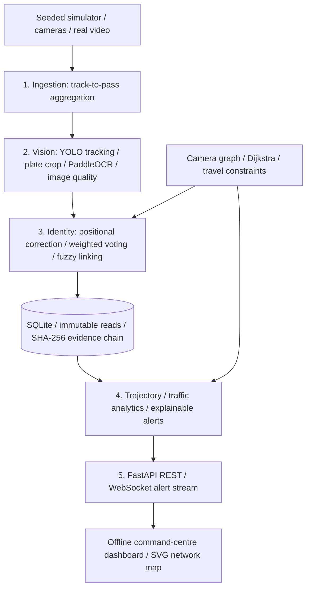

> **Current UI: Delhi mock-testing demo.** Open http://127.0.0.1:8000/?v=delhi-final#/trajectories and use the pre-filled demo sign-in. Test plate **DL01AB1234**. The app now includes 40 Delhi cameras, complete mock journeys, regional maps, heatmaps, attribute results and local traffic clips. See [the updated frontend guide](FRONTEND.md) for the test path, data provenance and source-file list. The Python backend documentation below remains available for independent backend testing.

# CityTrace · City traffic intelligence

Runnable offline prototype for **Smart India Hackathon 2026, SIH26127**: *City-Wide AI Engine for Multi-Camera ANPR Trajectory Tracking and Urban Traffic Analytics*, Bharat Electronics Limited problem statement. This is a hackathon implementation, not a certified government system or an official BEL product.

An eight-camera Delhi command centre converts noisy multi-frame plate reads into stable identities, traces road-network routes, measures traffic and explains security alerts. The current frontend is **React + TypeScript + Vite**, with Tailwind CSS, Framer Motion, locally bundled Leaflet and Recharts. FastAPI serves its included production build at `/`. The NEXUS Python evidence engine is retained. No CDN, remote font, GPU or camera is needed for the demo; online OpenStreetMap tiles are optional.

**Start with [FRONTEND.md](FRONTEND.md)** for the React setup, demo sign-in credentials, screen-by-screen capabilities and explicit integration limits. The original single-file dashboard remains as a fallback only when no React build exists.

## Run in five minutes

Requires **Python 3.11**. From this project folder:

```sh
python -m venv .venv
# Windows PowerShell:
.venv\Scripts\Activate.ps1
# macOS/Linux instead: source .venv/bin/activate
python -m pip install -r requirements-dev.txt
python demo.py
python -m uvicorn anpr.api:app --host 127.0.0.1 --port 8000
```

Open **http://127.0.0.1:8000**, sign in with User ID **admin** and password **CityTrace@26127**, and click **Run simulation**. The demo access panel also provides Officer and Viewer accounts. Search `DL01AB1234` with an authorised reason to open a vehicle profile, or `DL08CX9090` for the clone scenario. React refreshes data every 30 seconds and receives alert updates through a WebSocket. Displayed timestamps are IST. Simulation data is labeled; “active” means a camera has retained observations, not a hardware heartbeat.

The API reference at `/docs` is also self-contained and works offline; its schemas come from the local `/openapi.json` endpoint.

The evaluation runs with one command after installing dependencies:

```sh
python demo.py
# Optional: python demo.py --vehicles 320 --seed 26127 --output output/evaluation.json
python -m pytest -q
```

The demo uses its own in-memory database. It prints accuracy, a trajectory, traffic summary, alerts, integrity verification and a deliberate tampering test. Full results, including all corridors, OD pairs and minute buckets, are written to `output/evaluation.json`. It never tampers with the dashboard database. The API stores data in `data/nexus.sqlite3`, created automatically.

## Architecture



The simulator starts with synthetic OCR frames and bypasses neural inference. Real video is tracked before per-pass aggregation; the diagram shows logical layers, not a requirement to run OCR after a track closes.

| Module | Responsibility |
|---|---|
| `anpr/config.py`, `graph.py` | Eight illustrative Delhi camera coordinates, twelve road links, thresholds, shortest paths |
| `anpr/plates.py` | Indian state/standard/BH validation, positional look-alike corrections, weighted edit distance |
| `anpr/db.py` | Parameterized SQL, transactions, evidence hashing, retention checkpoint, audit |
| `anpr/vision.py` | Weighted voting, quality metric, track aggregation; OpenCV loads only when needed |
| `anpr/identity.py` | Exact aliases, gated fuzzy matching, conservative ambiguity rejection, canonical upgrades |
| `anpr/alerts.py` | Watchlist, impossible travel / clone, restricted-hours evidence |
| `anpr/trajectory.py`, `analytics.py` | Ordered hops, inferred nodes, GeoJSON, congestion, OD, density |
| `anpr/platform.py` | Atomic ingestion orchestration and idempotent event identifiers |
| `anpr/simulator.py`, `demo.py` | Synthetic generation, truth-only evaluation, scripted events, tamper test |
| `anpr/models.py`, `api.py` | Validated API inputs, roles, REST, authenticated WebSocket |
| `frontend/src`, `frontend/dist` | React + TypeScript source and bundled production UI served at `/` |
| `anpr/auth.py`, `frontend_api.py`, `registry.py` | JWT sessions, reason-audited profile APIs, mock registry adapter |
| `anpr/static/index.html` | Preserved legacy single-file fallback |
| `tools/process_video.py` | CPU video pipeline, local weights, optional annotated output, event spool |

## Identity and intelligence rules

- Plate text is uppercased and stripped to ASCII alphanumerics. Candidate standard layouts have two state letters, one or two district digits, one to three series letters and four digits. BH is `YYBHNNNNAA`, with year 21–99. The validator checks syntax and a state-code allowlist, **not whether a registration has been issued**. Special, diplomatic, military and temporary plates need more rules.
- Digit slots correct `O/D/I/L/Z/S/G/B`; letter slots use their digit look-alikes. Ambiguous corrections use a deterministic convention (`0→O`, `1→I`). These are uncertain OCR transformations, not proof of identity.
- Voting weights each character by OCR confidence × image quality, in the strongest length cohort. Reported confidence includes agreement, OCR certainty, quality and length-cohort support. All submitted reads remain in the immutable payload.
- Weighted Levenshtein gives listed look-alike substitutions cost 0.3; other substitutions, insertions and deletions cost 1. Exact canonical/alias matching happens first. Exact plate matches can represent clones, so their impossible travel is flagged instead of suppressed.
- Fuzzy candidates require the same vehicle type, an observation within 30 minutes and physically possible travel to **both chronological neighbors**. Distances up to 0.35 are allowed for valid high-confidence reads; up to 1.3 for lower confidence or invalid reads. Combined score is 75% normalized text similarity, 10% type agreement and 15% feasible topology, with threshold 0.88 and near-tie rejection. Canonical plates upgrade when a valid later read has materially higher confidence (or replaces an invalid canonical). Aliases are retained.
- Dijkstra infers shortest road paths; intermediate cameras are explicitly **inferred, not observed**. Total trajectory distance is an inferred route length, not GPS mileage. Implausible legs remain visible for investigation.
- Corridor speeds use consecutive observed detections on adjacent cameras, with 0 < gap ≤ 30 minutes, excluding speeds above 110 km/h. Their median determines `free-flow / median`: `<1.4 free`, `<2 moderate`, `<3 heavy`, `≥3 congested`. No speed samples means unknown, not zero congestion. Network average is the arithmetic mean of eligible leg speeds.
- OD trips split at gaps **greater than** 30 minutes; single-observation trips are excluded. Density and minute buckets count vehicle passes, including anonymous video tracks. Unique vehicles counts resolved plate identities only. It can be inflated by unresolved reads or merge distinct vehicles with the same plate.
- Exact watchlist matches are HIGH; look-alike matches ≤0.6 are MEDIUM with a visual verification instruction. Clone alerts require same normalized plate and impossible road speed; HIGH requires both confidence scores ≥0.8. A zero-time cross-camera sighting is impossible without reporting an infinite JSON number. Restricted hours use IST, including overnight windows.

## Measured synthetic evaluation

Python 3.11, seed **26127**, **320 random vehicles + 3 scripted vehicles**, six OCR frames per pass, approximately 5% missed passes. Conditions have differing random substitution rates, image quality, truncation and occasional correlated errors across an entire pass. `C04–C06` is a rush-hour bottleneck. Ground truth is used only in the evaluator, never passed to the resolver.

| Condition | Passes | Single frame + correction | After voting | Online identity | Final identity |
|---|---:|---:|---:|---:|---:|
| Blur | 246 | 13.01% | 83.33% | 91.87% | 92.28% |
| Day | 213 | 66.20% | 92.49% | 93.90% | 94.84% |
| Dirty | 207 | 16.91% | 91.79% | 96.14% | 93.24% |
| Night | 249 | 40.56% | 92.37% | 96.39% | 96.39% |
| Rain | 220 | 21.36% | 84.55% | 95.00% | 96.36% |

Each number is pass-level exact registration-string accuracy. Single-frame uses the first frame after positional correction, rather than raw OCR. Online identity is the canonical at ingestion time; final identity reflects later canonical upgrades. Scripted clean events are excluded from the accuracy table. Upgrades can also propagate mistakes: the dirty-condition regression is reported rather than hidden. This metric is not association precision/recall or a clone-classification accuracy metric.

**These figures come from simulated noise and must be re-measured on real footage.** They are not neural OCR benchmark results. Correlated blur, camera geometry, adversarial alterations, plate layouts and state frequency may differ radically from this generator. No GPU/neural model accuracy is claimed. A defensible field evaluation requires labeled multi-camera tracks, identity-link precision/recall, false merge/split rates, alert precision/recall and calibrated OCR confidence.

## API and roles

Send `X-Role: viewer`, `officer` or `admin`. Missing role defaults to viewer; admin inherits officer permissions. JSON requests reject unexpected fields, timezone-free timestamps, invalid confidence ranges and excessive frame lists. Ingest retries with the same event ID return the original event; producers must keep identifiers unique and retry the identical payload.

| Endpoint | Minimum role |
|---|---|
| `GET /`, `GET /api/health`, `GET /docs`, `GET /openapi.json` | Public |
| `GET /api/cameras` | viewer |
| `GET /api/analytics/summary` | viewer |
| `GET /api/analytics/origin-destination` | viewer |
| `GET /api/analytics/heatmap` | viewer |
| `GET /api/integrity` | viewer |
| `POST /api/ingest` | officer |
| `POST /api/traffic` | officer |
| `GET /api/trajectory?plate=DL01AB1234` | officer; every accepted search is audited, including no-match searches |
| `GET /api/alerts?limit=100` | officer |
| `GET /api/watchlist`, `POST /api/watchlist` | officer |
| `POST /api/simulate` | admin |
| `GET /api/audit?limit=100` | admin |
| `POST /api/purge` | admin |
| `WS /ws/alerts` | officer, admin |

Example payload for `POST /api/ingest`:

```json
{"event_id":"camera-1-track-42","camera_id":"C01","timestamp":"2026-09-30T08:30:00+05:30","vehicle_type":"car","reads":[{"text":"DL O1 AB I234","confidence":0.91,"quality":0.88}],"source":"camera-gateway"}
```

`POST /api/traffic` accepts the same event metadata **without** `reads`, for tracks whose plates are unreadable. These observations contribute to density only; they are not plate evidence and are outside the detection hash chain. `POST /api/watchlist` accepts `{"plate":"DL01AB1234","reason":"Authorized case reference"}`. `POST /api/simulate` accepts `{"vehicles":320,"seed":26127}`. The same seed and UTC date replay idempotently; a different seed adds another batch. The simulator starts at 08:30 IST on the API host’s current UTC date. Its scripted night event is intentionally synthetic, even if it lies in the future relative to the live clock.

WebSocket clients connect and send `{"role":"officer","api_key":"..."}` as their first message within 10 seconds. The server responds with `connected`, then `alert` messages and heartbeats. The key is never placed in a URL. Bounded client queues can drop old messages for slow clients; REST is authoritative for backfill. The dashboard reconnects automatically. One process is supported; multiple workers need shared alert pub/sub and database coordination.

## Real video

Both requested Intel clips are included in `samples/` with the original CC BY 4.0 licence and attribution in [samples/README.md](samples/README.md). They are suitable for **detection, tracking and density**. Plates are usually too small to read; OCR accuracy must be tested on footage with legible plates.

Install optional CPU packages and separately obtain compatible, lawfully licensed model weights:

```sh
python -m pip install -r requirements-vision.txt
# In another terminal, start the API first.
python -m tools.process_video samples/car-detection.mp4 --camera C04 --vehicle-model models/yolo11n.pt --detect-only --output-video output/annotated.mp4

# For footage with legible plates, using PaddleOCR 3.x inference directories:
python -m tools.process_video your-video.mp4 --camera C01 --vehicle-model models/yolo11n.pt --plate-model models/indian-plates.pt --ocr-det-dir models/ocr-det --ocr-rec-dir models/ocr-rec --start 2026-09-30T08:30:00+05:30
```

All model arguments refer to existing local files/directories so the application does not silently download models. YOLO vehicle weights must use COCO vehicle class IDs (car 2, motorcycle 3, bus 5, truck 7). A plate-specific detector is recommended. Without `--plate-model`, OCR uses an explicitly limited lower-centre vehicle crop heuristic. Neural processing uses CPU and can be slow. OpenCV and neural imports are lazy; they are not part of the core dependency set. Upstream library versions may perform their own environment checks; fully offline deployments should preinstall and validate the optional runtime and models.

YOLO tracks consecutive frames, OCR samples every five frames, quality weights sharpness and exposure, and the aggregator emits once a track disappears or at EOF. At most 120 strongest reads are submitted per track. Unreadable tracks are posted only as anonymous traffic passes. The API dashboard refreshes density; identified alert-producing reads arrive through the stream. ID changes caused by occlusion can split one physical pass. A line-crossing gate and calibrated tracking are future field work.

The tool spools every attempted API event to `output/video-events.jsonl` before sending. Network failures are retried three times, then reported without discarding the spool. Replay the same endpoint/event JSON with the same event ID to avoid duplicates. Capture start defaults to the current UTC time; provide `--start` for stable replay identity. No synthetic OCR text is substituted when real OCR fails. Neural inference itself is optional and is **not covered by the core test run**; the OCR result adapter and aggregation are tested without model downloads. See [Ultralytics tracking documentation](https://docs.ultralytics.com/modes/track/) and [PaddleOCR 3.x documentation](https://www.paddleocr.ai/main/en/version3.x/pipeline_usage/OCR.html).

## Privacy, governance and deployment limits

The default self-selected `X-Role` is a **demo authorization boundary, not authentication**. Anyone who can reach the local demo can select admin. Bind to localhost. For a controlled deployment set `ANPR_DEMO_MODE=false` and `ANPR_API_KEY` to a secret provided by your environment. The API refuses this mode without a key. A shared key alone does not establish a person's role: place it behind a trusted identity gateway that authenticates users, strips client role headers and injects authorized roles. The browser Access dialog holds a supplied key in tab memory only. Never expose this prototype directly to the public internet.

Plate searches and watchlist changes write audit records; simulation and purge operations are also logged. Use authorized case references, restrict access to plate evidence, document purposes and obtain an appropriate legal basis before field collection. Encrypt storage/backups, secure transport, synchronize camera clocks, protect model supply chains, apply rate limits and export access logs to a separate secured system. Audit logs and watchlists also contain sensitive identifiers and require their own governance/retention policy. The prototype does not automatically delete these records or original videos/spool files.

Every identified detection contains raw reads, voting confidence, resolution decision and source metadata in a SHA-256 hash chain. Verification checks payloads, indexed columns, order, stored count and tail. This detects accidental/partial alteration and deleted tails while metadata is trusted. **It is not proof against an administrator who rewrites the entire database and chain metadata.** Export/sign head and retention checkpoints into independent append-only storage for stronger guarantees. Identities, watchlist, audit and anonymous traffic tables are not independently hash-chained. No plate crop image is persisted by the demo; actual visual corroboration needs a governed evidence store.

Retention: `POST /api/purge` with `{"before":"2026-10-01T00:00:00Z"}` removes only the contiguous expired **ingestion-order prefix**, deletes its related alerts and unused identities/aliases, and keeps the boundary hash as a checkpoint. It never rehashes surviving evidence. Late old events after a nonexpired event are conservatively retained until a later purge can remove that prefix. Anonymous traffic is purged by its timestamp. Purge refuses to run if integrity already fails. Schedule and authorize retention externally; there is no automatic destructive timer.

Alert results are investigative leads requiring human review, not grounds for automated penalties. Shared plates, OCR confusions, clocks and road geometry can generate false positives. The Delhi camera positions, road distances, free-flow speeds, restrictions and synthetic records are illustrative, not verified city infrastructure.

Plain parameterized SQL is isolated in the persistence/service layer with no ORM dependency. **PostgreSQL/PostGIS is a migration target, not a literal zero-change swap**: adapt the DB driver/placeholders, SQLite PRAGMAs and identity allocation, transaction/locking rules, and optionally replace coordinates with spatial columns. SQLite single-process execution is intentionally scoped to a laptop demo. City scale needs indexed candidate retrieval, geospatial routing, message queues, ingestion authentication, operational monitoring, storage policies and load testing.

## Container

```sh
docker build -t nexus-anpr .
docker run --rm -p 127.0.0.1:8000:8000 -v nexus-data:/app/data nexus-anpr
```

The image runs as a non-root user and includes the offline core and sample clips. The optional vision dependencies/models are deliberately excluded. Docker requires network access during initial dependency installation. Container startup and neural inference require separate validation on your target machine; core Python tests and local browser verification are the primary delivered checks.

## Test coverage

`python -m pytest -q` covers plate correction/validation and BH, weighted edits, voting confidence, track aggregation, graph paths, fuzzy upgrade/rejection by speed/type/confidence/age, late arrivals, clone severities, watchlist/restricted hours, inferred trajectories, congestion/OD/density, ingestion deduplication, hash tampering/deletion, anchored retention, seeded replay, every API endpoint, role restrictions, input validation, gateway key checks and authenticated WebSocket delivery. The core runs without YOLO, PaddleOCR or OpenCV installed.
